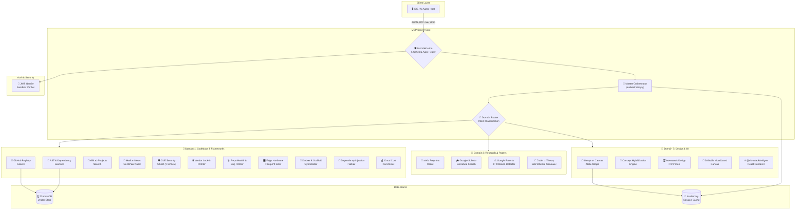

<div align="center">
  
  <h1>Multi-Domain Semantic Architect Agent</h1>
  <p><strong>Cross-Domain Cross-Pollination & Ideation Engine for AI Agents</strong></p>

  <p>
    
    
    
    
  </p>
</div>

---

The **Multi-Domain Semantic Architect Agent** (Ideation GOAT) is an enterprise-grade Model Context Protocol (MCP) server that operates as the analytical and creative subconscious of advanced AI coding agents. It exposes **24 autonomous diagnostic tools** spanning three distinct knowledge domains — local codebase architectures, academic research publications, and visual UI design portfolios — enabling AI agents to validate technical compatibility, audit supply-chain security, hybridize cross-domain concepts, and scaffold production-ready project environments in a single unified pipeline.

Powered by **Gemini 3.1 Flash Lite** for high-speed structural reasoning, protected by **Zod-based auto-healing middleware** that self-corrects malformed LLM parameters at runtime, and compiled via the **NitroStack** framework for serverless MCP hosting on NitroCloud.

---

## 🏗️ System Architecture



---

## ⚡ Capability Matrix

### 🛠️ 24 Autonomous Tools

| # | Tool | Domain | Purpose |
|:--|:-----|:-------|:--------|
| 1 | `search_knowledge_grid` | D1 & D2 | Multi-domain semantic search with Target and Discovery modes |
| 2 | `breed_concepts` | D3 | Cross-pollinate two paradigms into a hybrid architectural blueprint |
| 3 | `bridge_code_and_theory` | D2 | Bidirectional code ↔ LaTeX mathematical translation |
| 4 | `assess_viability` | D2 | Patent collision detection and defensive evasion strategy |
| 5 | `search_academic_papers` | D2 | Parallel arXiv + Google Scholar literature sweep |
| 6 | `write_scaffolding_files` | D1 | Automated project skeleton and boilerplate generator |
| 7 | `verify_workspace_fit` | D1 | License and ecosystem compatibility auditor |
| 8 | `compose_solution_stack` | D1 | Multi-layer architectural decomposition and framework matching |
| 9 | `get_repo_health` | D1 | Real-time GitHub health, stars, and CVE telemetry |
| 10 | `profile_repo_hardware_footprint` | D1 | Edge device SRAM/Flash memory footprint estimation |
| 11 | `align_system_architecture` | D1 | Directory structure pattern detection and alignment scoring |
| 12 | `analyze_workspace_ast` | D1 | Zero-friction offline AST and dependency tree parser |
| 13 | `check_repo_health` | D1 | Supply-chain risk and maintenance health auditor |
| 14 | `check_ecosystem_lockin` | D1 | Vendor lock-in dependency scanner and portability grader |
| 15 | `analyze_repo_bugs` | D1 | TF-IDF semantic clustering of chronic bug patterns |
| 16 | `orchestrate_architectural_workflow` | D1 & D2 | Unified multi-step diagnostic pipeline orchestrator |
| 17 | `forecast_live_costs` | D1 | Cloud hosting cost estimator (AWS, Vercel, Supabase, Neon) |
| 18 | `auto_heal_parameters` | Core | Zod-based autonomous parameter type coercion and typo correction |
| 19 | `verify_identity_token` | Core | JWT authentication sandbox with scope verification |
| 20 | `profile_dependency_injection` | D1 | DI pattern quality scanner and modularity scorer |
| 21 | `generate_docker_scaffolding` | D1 | Multi-stage Dockerfile and docker-compose generator |
| 22 | `scan_local_cves` | D1 | OSV.dev vulnerability scanner with severity-based execution gates |
| 23 | `search_gitlab_repos` | D1 | GitLab project registry search integration |
| 24 | `audit_hacker_news_trends` | D1 | Real-time developer sentiment and mention trend auditor |

---

## ⚖️ Ethical Coding Principles & Privacy Safeguards

The Multi-Domain Semantic Architect Agent is designed from the ground up to respect developer environments and enforce ethical integration patterns:

1. **Local-First Privacy Guard**: Codebase analysis (such as AST scanning and import parsing) runs entirely locally and offline. Your source code is never transmitted to external APIs or training pipelines.
2. **Strict File System Boundaries**: The scaffolding tool implements strict directory traversal checks. Write operations are restricted strictly within the user-authorized workspace directory, protecting systemic operating files.
3. **No Unverified Third-Party Imports**: The engine does not download executable packages autonomously. It identifies and scores dependency trees so developers can make informed installation decisions.
4. **Copyleft License Guardrail**: The system proactively flags copyleft licenses (such as GPL/AGPL) if it detects integration with closed-source commercial workspaces, protecting projects from legal contagion.
5. **API Rate-Limit Etiquette**: Connections to public APIs (arXiv, Google Scholar, GitHub, OSV.dev) use caching, exponential backoff, and unauthenticated endpoints to avoid resource abuse and rate limits.
6. **Ecosystem Portability Advocacy**: The server actively identifies proprietary cloud vendor lock-in to help developers maintain technical sovereignty and build platform-agnostic software.

---

## 📦 Installation & Setup

### 1. Clone the Repository
```bash
git clone https://github.com/suzaykid/ideation-goat.git
cd ideation-goat
```

### 2. Configure Python Virtual Environment & Dependencies
Create and activate an isolated environment named `.venv` in the project root:

* **macOS / Linux**:
  ```bash
  python3 -m venv .venv
  source .venv/bin/activate
  ```
* **Windows (Command Prompt)**:
  ```cmd
  python -m venv .venv
  .venv\Scripts\activate.bat
  ```
* **Windows (PowerShell)**:
  ```powershell
  python -m venv .venv
  .venv\Scripts\Activate.ps1
  ```

Upgrade package manager and install python packages:
```bash
pip install --upgrade pip
pip install -r requirements.txt
```

### 3. Install TypeScript Wrapper Dependencies
```bash
pnpm install
```

### 4. Configure Environment Variables
Copy the template configuration and populate the required API keys:
```bash
cp .env.example .env
```

Open `.env` and fill out the configuration placeholders:
* `GEMINI_API_KEY`: API key for Gemini LLM synthesis.
* `GITHUB_TOKEN`: Optional GitHub PAT to bypass rate-limits for remote searches.
* `GITLAB_API_TOKEN`: Optional GitLab API token for GitLab repository searches.
* `CHROMA_DB_PATH`: Path to the vector database collection.

---

## 🚀 Running the Server

### Standalone stdio Mode
You can run the server directly in your terminal to verify that it starts correctly:
```bash
python server.py
```

### Integration with Claude Desktop
To integrate the server with your desktop agent, edit your `claude_desktop_config.json` configuration file:
* **macOS**: `~/Library/Application Support/Claude/claude_desktop_config.json`
* **Windows**: `%APPDATA%\Claude\claude_desktop_config.json`

Replace `/ABSOLUTE/PATH/TO/ideation-goat` with the actual absolute path to your repository.

#### Configuration (macOS / Linux)
```json
{
  "mcpServers": {
    "ideation-goat": {
      "command": "/ABSOLUTE/PATH/TO/ideation-goat/.venv/bin/python",
      "args": [
        "/ABSOLUTE/PATH/TO/ideation-goat/server.py"
      ]
    }
  }
}
```

#### Configuration (Windows)
```json
{
  "mcpServers": {
    "ideation-goat": {
      "command": "C:\\ABSOLUTE\\PATH\\TO\\ideation-goat\\.venv\\Scripts\\python.exe",
      "args": [
        "C:\\ABSOLUTE\\PATH\\TO\\ideation-goat\\server.py"
      ]
    }
  }
}
```

---

## 🧪 Verification & Test Suite

Verify that all modules and integration flows function correctly by running the unit test suite offline:
```bash
python3 -m unittest discover tests
```

---

## 🚀 Deployment to NitroCloud

Deploy the fully configured MCP server to the serverless NitroCloud platform:
```bash
nitro deploy --prod
```

---

## 🎨 Interactive Resources

### Constellation Map Graph (`ideation-goat://canvas`)
The server exposes a custom MCP resource mapping cognitive paths. It returns a node-and-edge JSON graph containing:
* **Nodes:** Matched codebase topics, patents, and academic papers.
* **Edges:** Cognitive distances and relational overlaps.
* **Use Case:** Frontends can fetch this URI to render interactive, node-based visual graphics showing where ideas intersect.

---

## 📄 License & Restrictions

This project is licensed under the GPL-3.0 License.

### Automated Training & Ingestion Restriction
* **NO AI Training Ingestion**: Ingestion of code, text, layouts, designs, or assets for training, validation, testing, or tuning of machine learning models or neural networks is strictly prohibited.
* **NO Automated Scraping**: Scraping, harvesting, or automated crawling of this repository by spiders or scraper bots is prohibited.
* **Personal/Human Use Only**: Access is provided strictly for human code inspection and educational review.
